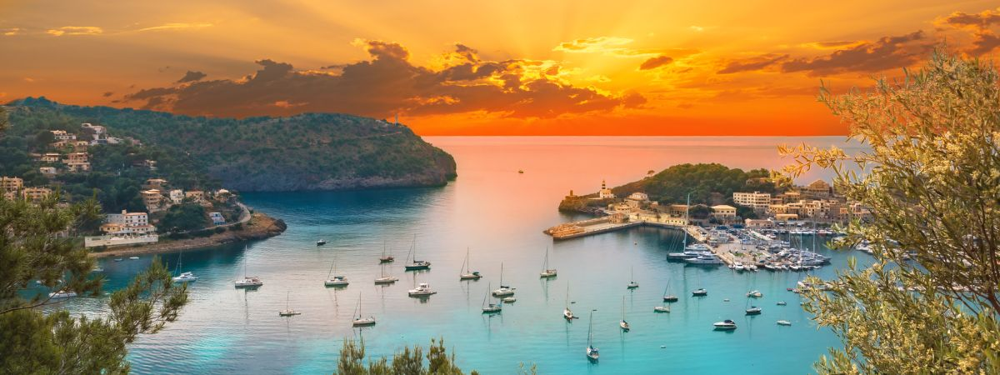
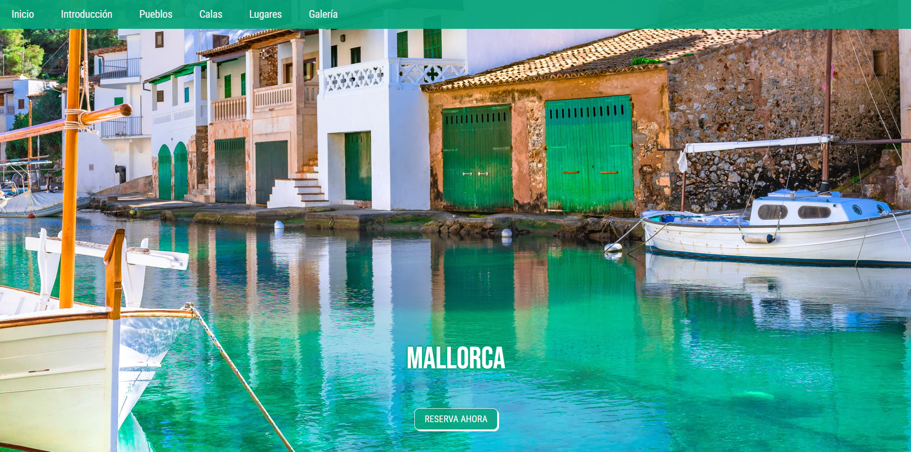
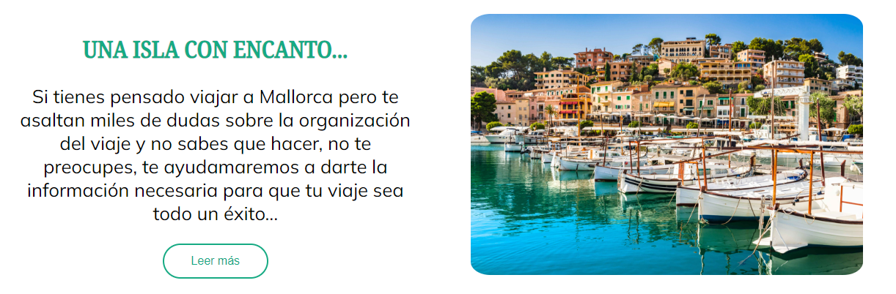
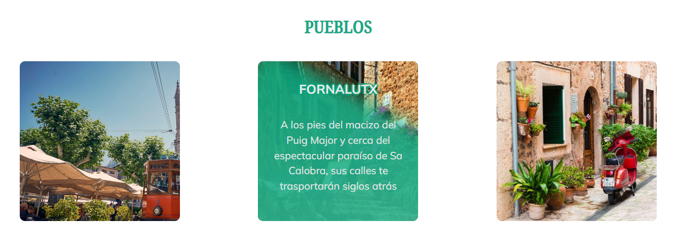
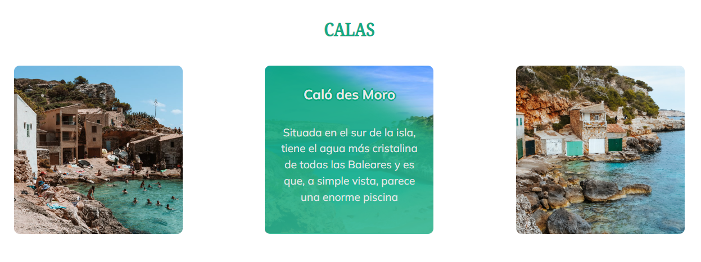
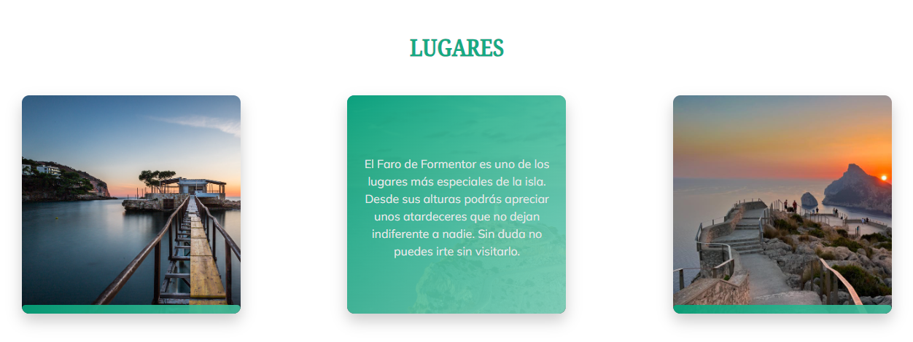
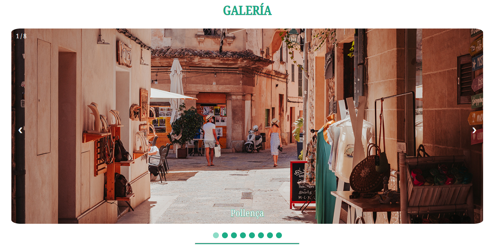
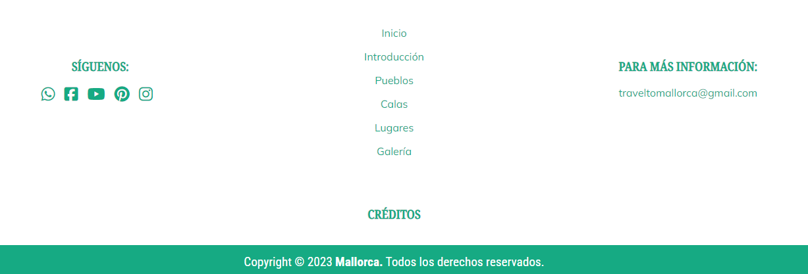

<h1>Memoria de proyecto de fin de evaluación de Lenguajes de Marcas</h1>
 

<h2>MALLORCA</h2>
<h2>Indice</h2>
<ul>
  <li><a href="#introduccion">Introducción</a></li>
  <li><a href="#motivacion">Motivación</a></li>
  <li><a href="#estructura">Estructura</a></li>
  <li><a href="#estilo">Estilo</a></li>
</ul>

<h2 id="introduccion">Introducción</h2>

Trabajo realizado por Alba Romero

Proyecto de web "from scratch" de la primera evaluación de Lenguajes de Marcas

Diciembre de 2023 

CopyRight ©

<h2 id="motivacion">Motivación</h2>

El tema lo he elegido ya que me encanta viajar a diferentes partes del mundo, pero en concreto, cuando visité Mallorca, quede totalmente enamorada. La idea es que esta página sirva para que otras personas puedan visitar los que, desde mi punto de vista, son los lugares imprescindibles de la isla.

<h2 id="estructura">Estructura</h2>

La web está dividida en 7 secciones:

<ul>
  <li>Hero Section</li>  
  <li>Introducción</li>
  <li>Pueblos</li>
  <li>Calas</li>
  <li>Lugares</li>
  <li>Galería</li>
  <li>Footer</li>
</ul>

<h3>Hero Section</h3>

Para esta sección he usado una imagen de fondo tomada de Civitatis, es responsive en todo los tamaños de dispositivos diferentes. Por otro lado, he incluido en su interior un rótulo de texto con el título de mi página y un botón de Call to Action para que las personas puedan pulsar y directamente les lleve a una nueva pestaña donde podrán reservar su próximo viaje.

<h3>Introducción</h3>

Para esta sección he usado un grid de dos columnas, una para el texto y otra para la imagén. Un Diseño que considero simple pero estético. Por otro lado, he hecho uso de un botón de "Universe.io" que nos permitirá ir a otra subpágina para poder leer toda la información, en caso de que nos interese. De esta forma, puedo asegurar que la página principal no quede sobrecargada de texto y vaya acorde con la imagen.

<h3>Pueblos</h3>

Para esta sección, he usado un grid de tres columnas, incluyendo en todas ellas una card tomada de "Universe.io" de nuevo. Esta sección, tanto las dos siguientes, son totalmente responsives ya que para el tamaño de dispositivos pequeños se colocan en una sola columna y para dispositivos con mayores dimensiones, se colocan ocupando las tres columnas que el ancho permite.

<h3>Calas</h3>

Esta seccción es totalmente igual que la anterior. En ambas se puede apreciar como al colocar el ratón sobre la imagen, se crea un efecto hover en el que se muestra sobre un fondo verde con gradiente, un texto con una breve descripción del lugar.

<h3>Lugares</h3>

En este caso, también utilizo un grid de tres columnas pero con unas cards con un diseño distinto, también sacadas de "Universe.io". Al igual que el las dos secciones anteriores, son totalmentes responsives y tienen un efecto hover que queda muy estético.

<h3>Galería</h3>

Para la galería, he obtenido un code snippet de la famosa página "W3Schools". Un slider simple pero dinámico y estético. Consta de 8 fotos diferentes de varios lugares de la isla y con su pie de página para que la persona pueda saber que lugar esta visualizando.

<h3>Footer</h3>

En esta última sección he usado un grid de tres columas con una organización distinta a las secciones anteiores. El footer consta de un apartado "siguénos", donde pueden localizarse todos los enlaces a las redes sociales, un apartado para los enlaces que se encuentran también en la barra de navegación, para que sea así más cómodo desplazarse por la web y un apartado con un email de contacto. Además, se incluye un enlace a créditos que abre un modal box, obtenido también de "W3Schools" y que contiene todas las atribuciones a las imagenes y elementos usados en mi página.

<h2 id="estilo">Estilo de la página</h2>
 
<h3>Paleta de colores</h3>

Tono blanco (#White)

Tonos verdes (rgba(5, 164, 122, 0.932), rgba(20, 210, 159, 0.932), #81d7c0e8, etc.)

 
<h3>Tipografías</h3>

BebasNeue-Regular

Caveat-VariableFont

HedvigLettersSans

Mulish-VariableFont

NotoSerif_Condensed-Medium

Ubunto-Bold

 
<h3>Imágenes</h3>

Fickr

 

<h2 id="snippets">Code snippets</h2>

He utilizado los siguientes:

<ul>
  <li>Barra de navegación: tomada de w3Schools "How to" (poner vínculo)</li>
  <li>Accordion: ..............</li>
  <li>..........</li>
</ul>
